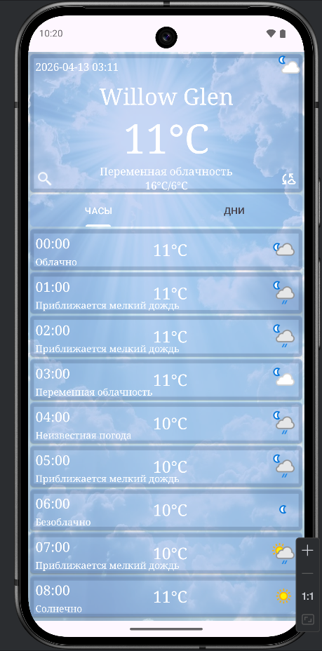
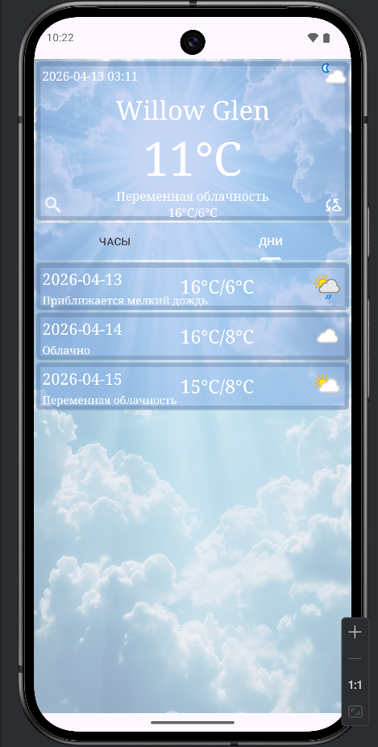

# 🌦 WeatherApp

Простое Android-приложение для отображения погоды.

---

## 🛠 Технологический стек
- Kotlin
- Hilt (Dependency Injection)
- Volley (network)
- MVVM + Clean Architecture

---

## 🧱 Архитектура

Проект разделён на слои:

- **data** — работа с API, DTO, мапперы  
- **domain** — бизнес-логика, use cases, интерфейсы  
- **presentation** — UI, ViewModel  

---

## 📸 Скриншоты

  
  

## 🚀 Возможности
- Получение погоды по API  
- Прогноз по дням и часам  
- Разделение слоёв (Clean Architecture)  

---

## 📦 Как запустить
1. Клонировать репозиторий  
2. Открыть в Android Studio  
3. Запустить на эмуляторе или устройстве 
