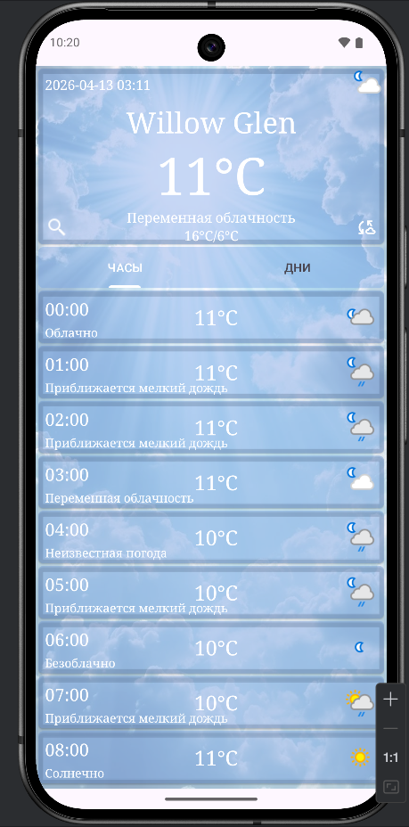
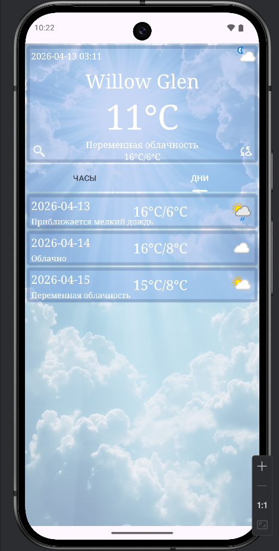

# 🌦 WeatherApp

Android-приложение для отображения текущей погоды и прогноза по дням/часам, написанное на Kotlin с применением Clean Architecture и MVI.

## ✨ Возможности

- 📍 Определение текущего местоположения через FusedLocationProvider
- 🔍 Поиск погоды по названию города
- 🌡 Текущая погода: температура, состояние, иконка, min/max
- 📅 Прогноз на 2 дня (макс/мин температура, состояние)
- 🕐 Почасовой прогноз
- 💾 Локальное кэширование через Room (работает офлайн)
- 🔄 Принудительное обновление данных по кнопке

## 🛠 Технологический стек

**Язык и асинхронность**
- Kotlin
- Coroutines + Flow (StateFlow, SharedFlow)
- ViewModel, Lifecycle, repeatOnLifecycle

**Архитектура**
- Clean Architecture (data / domain / presentation)
- MVI (Model-View-Intent)
- Repository pattern + Single Source of Truth (SSOT)

**Сеть**
- Retrofit 2
- OkHttp 3 + HttpLoggingInterceptor
- Gson + @SerializedName

**Локальное хранилище**
- Room (SQLite)
- Composite Primary Keys
- ForeignKey с CASCADE
- @Relation (одним запросом собирает current + forecast + hours)
- @Transaction для атомарного обновления

**DI**
- Hilt (Dagger Hilt)

**UI**
- ViewBinding
- Material Design Components
- RecyclerView + ListAdapter
- ViewPager2 + TabLayout
- Picasso

## 🧱 Архитектура

Проект разделён на три слоя с чёткими границами:
presentation → domain ← data

### 📦 data
- **remoteDataSource** — Retrofit API (`WeatherApi`), обёртка `RemoteData`
- **models (DTO)** — `WeatherResponseDTO`, `LocationDTO`, `CurrentDTO`, `ConditionDTO`, `ForecastDTO`, `ForecastDayDTO`, `DayDTO`, `HourDTO`
- **mappers** — `DtoToEntityMapper` (DTO → Entity), `EntityToDomainMapper` (Entity → Domain)
- **room** — `CurrentWeatherEntity`, `ForecastDayEntity`, `HourlyWeatherEntity`, `WeatherWithDetails` (@Relation), `WeatherDao`, `WeatherDataBase`
- **repository** — `RepositoryImplement`

### 📦 domain
- **models** — `DayItem`, `WeatherResult`
- **repository** — интерфейс `Repository`
- **useCases** — `GetCurrentWeatherUseCase`, `GetForecastWeatherUseCase`, `GetHoursWeatherUseCase`, `RefreshWeatherUseCase`

### 📦 presentation
- **fragments** — `MainFragment`, `DaysFragment`, `HoursFragment` (каждый со своим `ViewModel`, `UiState`, `UiEvent`)
- **holders** — `CityHolder`, `SelectedDayHolder` (@Singleton для связи между ViewModel)
- **adapters** — `RecyclerWeatherAdapter`
- **LocationProvider** — обёртка над FusedLocationProvider

### 🔄 Поток данных (SSOT)
Retrofit → DTO → Entities → Room → Flow → Domain → ViewModel → UI

text

**Retrofit пишет в Room. Всё остальное читается только из Room.** Это даёт:
- работу офлайн
- единый источник правды
- реактивное обновление UI при изменении БД

## 🎯 Что реализовано

- ✅ Отказ от Volley в пользу Retrofit + OkHttp
- ✅ Замена LiveData на StateFlow
- ✅ Переход с MVVM на MVI
- ✅ Кэширование через Room с нормализацией (3 таблицы)
- ✅ SSOT: single source of truth через Room
- ✅ Hilt для внедрения зависимостей
- ✅ Unit-тесты на ViewModel (mockk + StandardTestDispatcher)
- ✅ Обработка ошибок сети и парсинга
- ✅ Runtime permissions для геолокации
## 📸 Скриншоты

<p align="center">
  
  
</p>

## 🚀 Как запустить

1. Клонировать репозиторий:
   ```bash
   git clone https://github.com/Kirill2502/WeatherApp.git
   ```
2. Получить API-ключ на [weatherapi.com](https://www.weatherapi.com/) (бесплатный тариф).
3. Создать файл `local.properties` в корне проекта и добавить:
   ```properties
   WEATHER_API_KEY=твой_ключ
   ```
4. Открыть проект в **Android Studio**.
5. Собрать и запустить на эмуляторе или устройстве.
